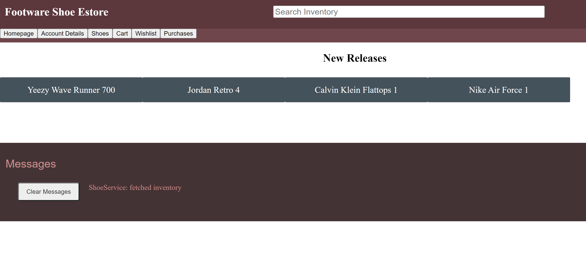

# FootWare E-Store Design Documentation

## Team Information
* Team name: 4d-footware
* Team members
  * Matthew Zhang (mtz5784)
  * Mathew Owusu Jr (mko9824)
  * Glenn Vodra (gkv4063)
  * Laxmi Poudel (lp2439)
  * Nishant Kharel (nk1359)

## Executive Summary
The project is the design and implementation of a store that buys and sells shoes electronically.

### Purpose

The project involves providing a page where customers are able to create accounts to buy shoes from the website. A second primary page, for an admin, provides options to add new shoes and customize pre existing shoes.

### Glossary and Acronyms

| Term | Definition |
|------|------------|
| SPA | Single Page |
| MVP | Minimum Viable Product |
| eStore | Store that accepts electronic transactions |
| DAO | Data Access Object |

## Requirements

### Definition of MVP

The goal is to create a shoe estore where an Owner (admin user) can manage a shoe inventory. Customers can create accounts and interact with the shoes in the inventory by saving them to their carts and checking out items. This product will be accessible via a modern web browser and will be able to handle multiple user sessions.
### MVP Features

* Minimal Authentication for customer/e-store owner login & logout
	* The server will (admittedly insecurely) trust the browser of who the user is. A simple username to login is all that is minimally required. Assume a user logging in as admin is the e-store owner.
	* You are not expected to do full credential and session management, although the system will look different depending on who is logged in. Obviously this isn't how things are done in real life, but let's sidestep that complexity for this class.
* Customer functionality
	* Customers will be able to see list of available products from a single inventory.
	* Customers can search for a product using a search bar at the top of the webpage. The user can search fields such as name, brand and type.
	* Customers can add and remove an item to their shopping cart. This will allow the user to keep track of items they wish to buy.
	* Customers can proceed to check out their items for purchase by clicking on a checkout option.
* Inventory Management
	* E-Store owners can add, remove and edit the data on the inventory. This includes all of he shoe's listed on the store.
* Data Persistence
	* The system saves everything to files such that the next user will see a change in the inventory based on the previous user's actions. So if a customer had something in their shopping cart and logged out, they should see the same items in their cart when they log back in.
* Your 10% feature
	* The owner can implement coupons that provide discounts. The customer will have the option to use them at checkout.

###Major Epic and Story Breakdown
* Sprint 1 (Stories)
	* Creating a Product
	* Getting the Entire Inventory
	* Getting a Single Product
	* Delete a Single Product
	* Update a Product
	* Search for Products
* Setting up the Backend (EPIC)
	* Handling Accounts
	* Handling Cart Requests 
* Make Basic Site (EPIC)
	* Wish-list request
	* Displaying and Viewing Inventory
	* Adding Services and Routing
	* Login
	* Cart
* Setup Wish-list (Story)
* Powerful Search (Story)
* Checkout Page (Story)
* Coupons (Story)
* Purchase History (Story)
* Transactions (Story)

### Roadmap of Enhancements
* UI

	* Adding images to the corresponding shoes will help user with visualization.
	* Adding a sign out button on the top right corner would be helpful rather than inside of the account.
	* Getting rid of the log messages would make the site more cleaner and would also avoid confusion
	* Hiding all the unnecessary information from the user such as shoe id and transaction number 
	* Making the navigation bar larger would make it easier to click and would look good too.
	* Adding a user manual or tips will help user get around the website easier.
	* Adding a buy now button can reduce the time it takes to buy the shoe without adding it to the cart. This will save user time and reduces chance of leaving the shoe in the cart.

* Backend
	* Fixing some of the design implementation of coupon such as checking whether a coupon had been used or not
	* Put expiration dates on coupon
	* Adding a notify class to notify seller when the inventory is low.  
	* Make all list type classes share the same shoe object instead of a new copy with the same details. This would allow shoes in wish-list and cart to be updated easily
	* Adding a notification class which will notify a buyer when the item is in the cart for more than a month.
	* Adding a recommendation feature to recommend shoes to the buyer based on the search history would improve user experience.

## Application Domain

This section describes the application domain.

Owners can add new shoes/modify shoes on the Shoe Warehouse. Customers are able to login/signup with accounts to add shoes onto their cart for ordering. Customers can also apply coupon/discounts at checkout while the Owner can view a sales list of what a customer bought. Shoes bought can be custom types such as Athletic or Formal shoes.

## Architecture and Design

This section describes the application architecture.

### Summary

The following Tiers/Layers model shows a high-level view of the webapp's architecture.

The e-store web application, is built using the Model–View–ViewModel (MVVM) architecture pattern. 

The Model stores the application data objects including any functionality to provide persistence. 

The View is the client-side SPA built with Angular utilizing HTML, CSS and TypeScript. The ViewModel provides RESTful APIs to the client (View) as well as any logic required to manipulate the data objects from the Model.

Both the ViewModel and Model are built using Java and Spring Framework. Details of the components within these tiers are supplied below.

### Overview of User Interface

The user navigates to the website using a url in their browser. If an invalid url is provided they will be redirected to the main page. From the main page users can click on a number of buttons located along a top bar to view the inventory, their account, cart and more. These options change depending on which user is signed into the site. While all of the site is built with HTML and CSS, the code is organized into angular components where each of these documents exists. This allows the site to be redesigned without worrying about messing with functionality. Below are two two images, the first showing an example of the ui, the second of the sequence of events for a simple ui component like search.

Ui Example

### View Tier
The view layer is handled by a light amount of HTML and CSS, that give a user's browser instructions on how to format and organize the content when the E-store is accessed. Each
component from the inventory, product page, and user profile have their own instructions on how this should be displayed. The user is not responsible for understanding how all
of this works, but it should be as responsive to the user as possible. The view layer is directly displayed to the customer, and if there are spelling issues or features that
don't scale properly it can make the experience frustrating for the user. By using HTML and CSS, we are creating as many opportunities for us as developers to display the
information in a viewable manner.

### ViewModel Tier
This model layer is handled by the Front-end Angular application. This layer outlines the framework for how data should be displayed once it is fetched from the controller. Angular includes a structure built around organizing features into components and services. This makes it very clear what possible pages/views will be accessible on the site. Some of the components that were created were a shoe component for displaying one singular shoe, and an inventory component for displaying all available shoes. These are independent of each other and handle the data they receive. There are also separate TypeScript files for routing, that allow a user to navigate between the different components. This is accessible with some clickable text that is displayed on every page of the site.

The ViewModel acts as a middle man between the View and the Model. As the user interacts with the View, the various angular services send various HTTP Request to the Java REST API Backend’s localhost. Use the Angular Services send out HTTP Request the classes in the controller tier handle the HTTP Request. The Controller classes are in charge of interacting with the persistence tier to fetch the necessary data and make the necessary changes to the data being stored in the JSON files.

The following diagrams are sequence diagrams show casing how certain features are truly working under the hood. They detail all the components, services and a classes at work to make certain features come to life.

### Model Tier
The following image shows the UML diagram for the ListInterface which is an interface that is used by 3 other classes (Wishlist, Cart, and PurchaseHistory). They all share same methods used to modify data in a list by using generics to define the type of data that is stored in the list.

These are the individual classes which are used to build the main components of this estore. The Shoe class is the one that manages how shoes are made and stored. Account class is used to store all data including wish-list, purchase history and etc. Coupon class is a 10% feature used during checkout. Transaction is a class created to store details of a purchase after checkout.

### Controller Tier

The back-end Rest API deals with the direct storage of data in a local JSON file and makes up the controller layer. It handles how data is processed and is there to ensure the
data is accessed in an intended manner. Using the Rest API allows resources to be added, removed, and edited on a server using HTTP requests. The controller is broken into two
layers that further ensure organization and control. Each type of data that is stored on the E-store has its own DAO that acts as a standard Java object and handles persistence.
This handles functionality such as adding numbers or accessing list-objects. Besides having a strict interface each DAO also has its own controller that handles HTTP requests
like GET, POST etc, and provides mappings to the DAO so that they can be serialized and deserialized. Some examples include deleting a shoe from the inventory or adding a shoe
to a cart. There are also Shoe and Account models that provide a clearly defined structure for creating objects of that type.

This account model utilizes 3 variables being the userName, displayName, and isAdmin with the standard getters and setters to be used for login page. When updating an account it fetches the existing account in the list and calls those methods to update the account object.

### Static Code Analysis/Design Improvements
Some design improvements for our codebase would be make all list type classes share the same shoe object instead of a new copy with the same details. This would allow us to easily update shoe details in both cart and wishlist. Currently both get updated by getting the account's cart and wishlist then individually calling their methods respective to updating a shoe in a list for the backend. Another would be coupon, some of the design implementation of this was done wrong such as checking whether a coupon has been used before or not. 

Some issues noticed after running the analysis was that we had messy code in an unorganized structure. Refactoring some of the code structure would help improve readability for the group and allow for easier modification of the codebase in the future. 

## Testing

### Acceptance Testing

All user stories have a 95% code coverage shown in the next section. Only some stories related to persistence have below 100% due to missed branches.

### Unit Testing and Code Coverage

Our code coverage is 95% with the strategy being to mock classes when necessary and testing all methods to see if they work as intended. We selected 95% as the minimum since most of the methods were simple to test and managed to meet that expectation.
For our Code Coverage we used Jacoco, this tool allowed us to ensure we were writing quality unit tests. We used to to make sure each possible case was truly covered by out unit tests. We used this to see which areas in our code needed more thorough testing

Our persistence tier had the lowest code coverage. We had a couple missed branches. The most glaring issues where in the InventoryFileDAO. We had trouble writing tests that were about to check for the branches in our decrementShoes function

